<p align="center">
  <h1 align="center">WIF — Was It Fixed?</h1>
  <p align="center">
    An AI-powered Slack bot that answers "Was this fixed yet?" for Sentry SDK releases.
  </p>
</p>

<p align="center">
  <a href="https://github.com/getsentry/wif/actions"></a>
  
  
  
  <a href="./LICENSE"></a>
</p>

---

## What is WIF?

SDK support engineers regularly need to answer a deceptively simple question: **"A customer is on SDK version X and sees bug Y — was this fixed in a later release?"** Answering it manually means digging through dozens of GitHub releases, cross-referencing PRs, and reading changelogs. WIF automates that entire workflow.

Mention **@wif** in a Slack thread with a bug description and SDK version, and it will:

1. 🔍 **Extract** the SDK, version, and problem from the conversation
2. 🗂️ **Resolve** which GitHub repository to query
3. 🔗 **Evaluate linked PRs** from the message for a fast-path answer
4. 📦 **Fetch the release range** after the reported version
5. 📝 **Scan release notes** batch-by-batch, scoring each PR for relevance
6. ✅ **Post a confidence-rated answer** back to the thread with supporting evidence

WIF exits early the moment it finds a high-confidence match — no wasted API calls, no unnecessary LLM tokens.

## How It Works

```mermaid
flowchart TD
    A["Slack @mention"] --> B["Extract Request · LLM"]
    B -->|"sdk, version, problem, links?"| C["Resolve Repository"]
    C -->|"owner/repo"| D{"Has links?"}
    D -- Yes --> E["Evaluate Linked PRs"]
    D -- No --> F
    E -- "High confidence" --> G["Post Answer to Slack"]
    E -- "Inconclusive" --> F["Fetch Release Range · GitHub API"]
    F -->|"releases after user's version"| H["Scan & Evaluate Release Notes · LLM + GitHub API"]
    H -- "High confidence → early exit" --> G
    H -- "All batches scanned" --> G
    G --> I(["✓ High · ⚠ Medium top 3 · ✗ No result · Defer"])
```



### Confidence Levels

| Level      | Meaning                                                          | Output                                    |
| ---------- | ---------------------------------------------------------------- | ----------------------------------------- |
| **High**   | PR explicitly fixes the reported symptom in the same subsystem   | "✓ Fixed in **vX.Y.Z**. See PR #N."       |
| **Medium** | PR is in the right area but doesn't directly mention the symptom | Up to 3 candidates, defers to maintainers |
| **Low**    | Speculative connection — discarded as noise                      | Not surfaced                              |

## Getting Started

### Prerequisites

- **Node.js** >= 22
- **pnpm** (package manager)
- A [Slack app](https://api.slack.com/apps) with Events API and Bot Token
- A [GitHub App](https://github.com/settings/apps) with read access to releases
- An [Anthropic API key](https://console.anthropic.com/)

### Installation

```bash
git clone https://github.com/getsentry/wif.git
cd wif
pnpm install
```

### Configuration

```bash
cp .env.example .env
```

Fill in the required values:

| Variable                 | Required | Description                      |
| ------------------------ | -------- | -------------------------------- |
| `SLACK_SIGNING_SECRET`   | Yes      | Verifies incoming Slack webhooks |
| `SLACK_BOT_TOKEN`        | Yes      | Bot token for Slack API calls    |
| `ANTHROPIC_API_KEY`      | Yes      | LLM for extraction and scoring   |
| `SENTRY_DSN`             | No       | Error tracking via Sentry        |
| `GITHUB_APP_ID`          | No       | Override default GitHub App ID   |
| `GITHUB_INSTALLATION_ID` | No       | Override default installation ID |

### Development

```bash
pnpm dev          # Start with live reload (tsx watch)
pnpm test         # Run tests (Vitest)
pnpm test:watch   # Tests in watch mode
pnpm lint         # ESLint
pnpm format       # Prettier
```

### Production

```bash
pnpm build && pnpm start
```

Or with Docker:

```bash
docker build -t wif .
docker run -p 3000:3000 --env-file .env wif
```

## API Endpoints

| Method | Path                  | Description              |
| ------ | --------------------- | ------------------------ |
| POST   | `/api/webhooks/slack` | Slack Events API webhook |
| GET    | `/api/health`         | Health check             |

## Architecture

The codebase follows a strict **workflow → subtasks → tools** layering:

- **Tools** are atomic — one external capability each, no cross-dependencies
- **Subtasks** compose tools via dependency injection — no API keys, no client init
- **Workflow** orchestrates subtasks in order, handles progress reporting

See [`docs/ALGORITHM.md`](docs/ALGORITHM.md) for the full specification.

## Contributing

1. Install [pre-commit](https://pre-commit.com/) hooks:
   ```bash
   pre-commit install && pre-commit install --hook-type commit-msg
   ```
2. Follow [Conventional Commits](https://www.conventionalcommits.org/) for all commit messages
3. Run the verification loop before submitting:
   ```bash
   pnpm build && pnpm test && pnpm lint && pnpm format
   ```

See [`AGENTS.md`](AGENTS.md) for detailed contributor and AI agent guidelines.

## License

[FSL-1.1-Apache-2.0](./LICENSE)
